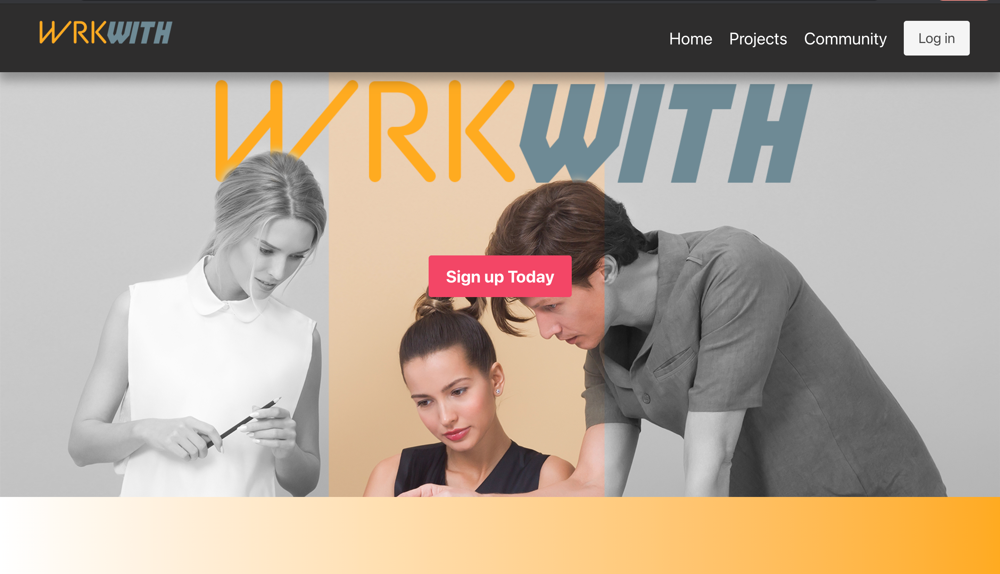

 
           

## Table of Contents

* [Description](#wrkwith)
* [Technology](#tech)
* [Dependencies](#depend)
* [Wireframe](#wire)
* [Getting Started](#Start)
* [Links](#links)
* [Screenshots](#Screenshots)
* [Usage](#Usage)
* [Presentation](#Presentation)
* [Licence](#Licence)
* [Collaborator](#Collaborator)
* [Badge](#Badge)

## WrkWith 
With WorkWith you can easily find collaborator for your ideas, your project, and make them become real!!! The portal is free and open to everyone. You only need to sign up!

## What technology has been used 

* HTML
* CSS
* Javascript
* Express.js
* Node.js
* Mysql
* Sequelize
* Express Handlebars
* Heroku

## NPM Dependencies

Run npm install in the terminal/command line:

*    "bcrypt": "^5.0.1",
*    "connect-session-sequelize": "^7.1.1",
*    "dotenv": "^10.0.0",
*    "express": "^4.17.1",
*    "express-fileupload": "^1.2.1",
*    "express-handlebars": "^5.3.2",
*    "express-session": "^1.17.2",
*    "mysql": "^2.18.1",
*    "mysql2": "^2.2.5",
*    "passport": "^0.4.1",
*    "passport-github2": "^0.1.12",
*    "sequelize": "^6.6.2"

## CSS Framework

* Semantic UI

_Semantic is a development framework that helps create beautiful, responsive layouts using human-friendly HTML._

## Wireframe

 

## Getting Started

These instructions will get you a copy of the project up and running on your local machine for development and testing purposes:

Clone the WrkWith repository and then create a MySQL database called wrkwith_db
Run node server.js (starts the server, creates the tables in wrkwith_db)
Visit localhost:3006

## Links

* [Code Repository](https://github.com/wa20/wrkwith-app)
* [Live website](https://wrkwith-app.herokuapp.com/homepage)

## Screenshots

 
 

## Usage

#### _The page can be viewed in both desktop and mobile version_

## Licence

#### Copyright (c) [2021] [Team 1, Project 2]
Permission is hereby granted, free of charge, to any person obtaining a copy
of this software and associated documentation files (the "Software"), to deal
in the Software without restriction, including without limitation the rights
to use, copy, modify, merge, publish, distribute, sublicense, and/or sell
copies of the Software, and to permit persons to whom the Software is
furnished to do so, subject to the following conditions :
The above copyright notice and this permission notice shall be included in all
copies or substantial portions of the Software.
THE SOFTWARE IS PROVIDED "AS IS", WITHOUT WARRANTY OF ANY KIND, EXPRESS OR
IMPLIED, INCLUDING BUT NOT LIMITED TO THE WARRANTIES OF MERCHANTABILITY,
FITNESS FOR A PARTICULAR PURPOSE AND NONINFRINGEMENT. IN NO EVENT SHALL THE
AUTHORS OR COPYRIGHT HOLDERS BE LIABLE FOR ANY CLAIM, DAMAGES OR OTHER
LIABILITY, WHETHER IN AN ACTION OF CONTRACT, TORT OR OTHERWISE, ARISING FROM,
OUT OF OR IN CONNECTION WITH THE SOFTWARE OR THE USE OR OTHER DEALINGS IN THE
SOFTWARE_

# Presentation

* [Presentation](https://docs.google.com/presentation/d/1FPX4IvmPFhk-965_9vu4g_NVPQou6VmRnGfm0KZgMOA/edit?usp=sharing)

## Collaborator

* Wael - <a href="https://github.com/wa20"> Github </a>
* Harith  - <a href="https://github.com/omnikron"> Github </a>
* Andrea  - <a href="https://github.com/lloret82"> Github </a>
* Bipin - <a href="https://github.com/"> Github </a>

## Badge

